# PostgreSQL auth using Kerberos
 
## Introduction

__Kerberos__ is a protocol for authenticating service requests. It works on the basis of tickets.
The Authentication Process
1. The user requests the service and sends a request for ticket-granting ticket (TGT) to the Kerberos authentication server (AS).
2. The AS verifies the user's identity and send back an encrypted TGT 
3. The user decrypts the TGT and sends it to the ticket-granting server (TGS) for a service ticket.
4. The TGS verifies the TGT and send a service ticket back.
5. The user receives the service ticket and sends it to the service server.
6. Now the client can acces the requested service


__PostgreSQL__ is a well known relational database management system that uses SQL and is known for its performance, scalability, reliability, and security.

## 1- Changing Hostnames

We start by executing this command
```
hostnamectl --static set-hostname kdc.insat
```
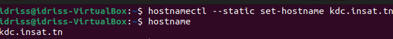

We do this step for the 2 other machines (service and client machines).

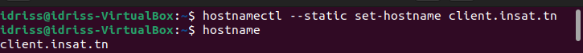

(Client's hostname: client.insat.tn)


## 2- Getting IP Adresses

Now we need to get the IP Adresses of all the three machines. We can use this command to do that
```
hostname -I
```
```
In our case the IP adresses found are :
KDC: 192.168.56.104
Service: 192.168.56.105
Client: 192.168.56.106
```

> **Note** : All 3 machines need to have a Host-only Adapter.


## 3- Adding IP Adresses in /etc/hosts files

The next step is to add the IP adresses of the three machines in /etc/hosts files.
We execute this command : 
```
sudo gedit /etc/hosts
```
and we add these 3 lines in the /etc/hosts file for all of 3 machines
```
192.168.56.104  kdc.insat.tn kdc
192.168.56.105  pg.insat.tn pg
192.168.56.106  client.insat.tn client
```

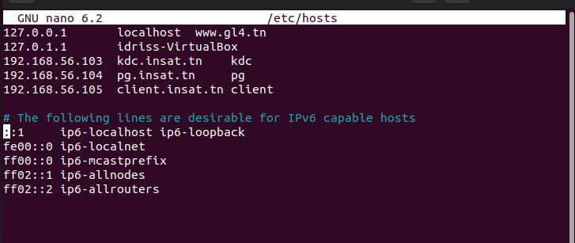

Now we can test our configuration by executing for example in kdc machine:
```
nslookup client
```


We can test the communication with: 
```
ping client
```
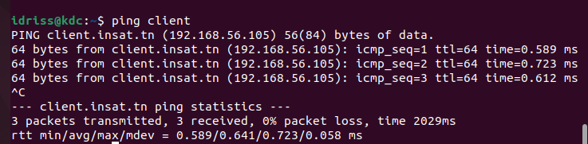

and in client machine we can try: 
```
ping kdc
nslookup kdc
```
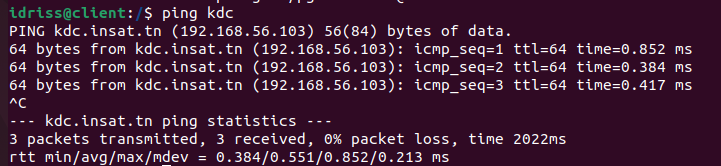


## 4- Setting The KDC

Now that all our 3 machines can communicate we need to set the KDC server.
We first start exectuing these commands in order to install krb5-kdc, krb5-admin-server and krb5-config libraries needed for this step:
```
sudo apt-get update
sudo apt-get install krb5-kdc krb5-admin-server krb5-config
```
> - **krb5-kdc :** provides the central authentication server for Kerberos.
> - **krb5-admin-server :** provides the administration server for the KDC.
> - **krb5-config :** provides configuration files and scripts for setting up and managing a Kerberos realm.

When installing the packages, some prompts will appear in order to configure the KDC server

Realm : INSAT.TN (must be in uppercase)
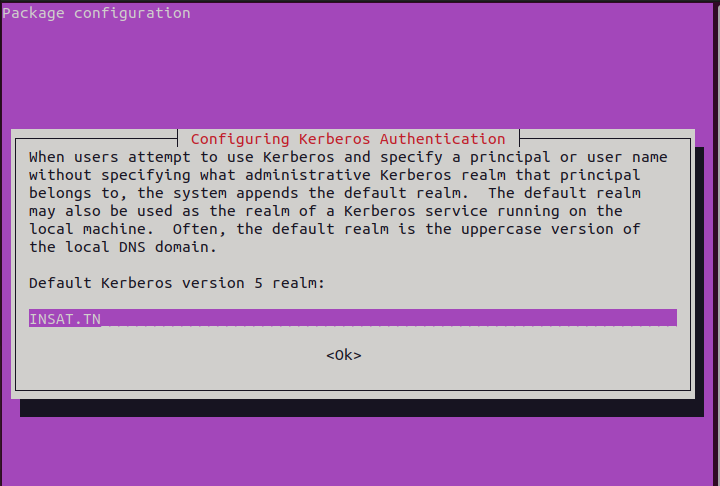

Kerberos server : kdc.insat.tn
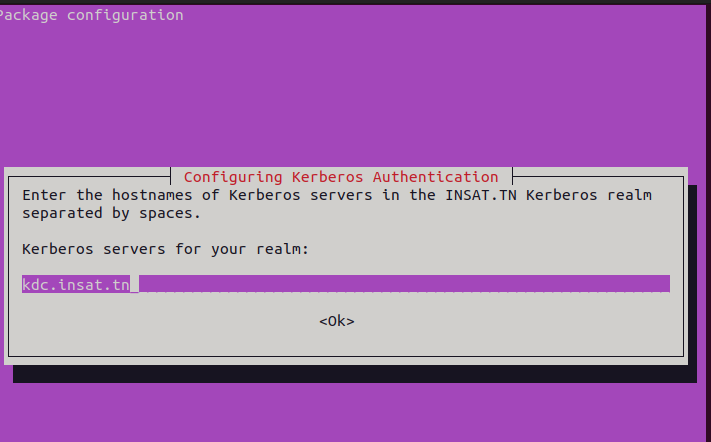

Administrative server : kdc.insat.tn (in our case it's the same as the kdc server)
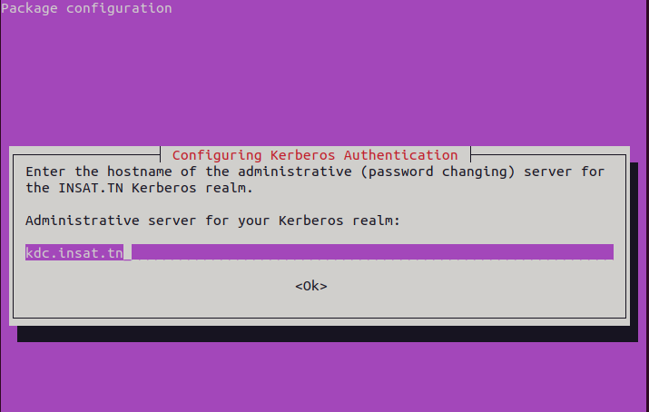

We now execute this command :
```
sudo krb5_newrealm
```
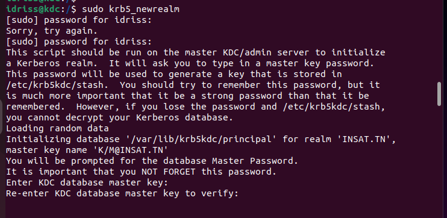

> **krb5_newrealm :** this command create a new Kerberos realm on a server. It will create new Kerberos database and administration server key, generate a new Kerberos configuration file for the new realm and set up the initial set of administrative principals and policies for the new realm.

#### Adding The Principals:

Now we need to add the principals needed (users and services are considered as principals)

So we start with the admin principals:
```
sudo kadmin.local
kadmin.local:  add_principal root/admin
```

We can verify that the principal is created
```
kadmin.local:  list_principals
```

Next, we need to grant all access rights to the Kerberos database to admin principal root/admin in the configuration file /etc/krb5kdc/kadm5.acl
```
sudo nano /etc/krb5kdc/kadm5.acl
```
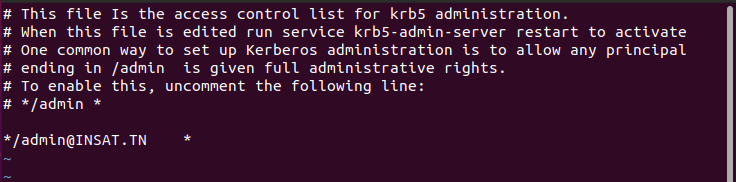

Now we create the other 2 principals with theses 2 commands : 
```
kadmin.local:  add_principal idriss
kadmin.local:  add_principal postgres/pg.insat.tn
```

Now we verify if they were added successfully
```
kadmin.local:  list_principals
```
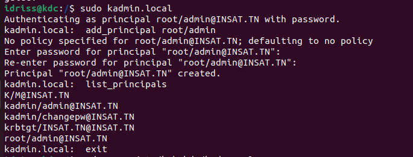


## 5- Setting The Service

We start by installing those packages
```
sudo apt-get update
sudo apt-get install krb5-user libpam-krb5 libpam-ccreds
```
> - **krb5-user :** provides command-line tools for interacting with a Kerberos system.
> - **libpam-krb5 :** PAM module that allows Linyx systems to authenticate users with Kerberos.
> - **libpam-ccreds :** PAM module that cashes user credentials for subsequent authetication requests.

the same prompts as in the KDC server will appear and we need to enter the same informations used for the KDC server.
 - Realm : INSAT.TN
 - Kerberos Server : kdc.insat.tn
 - Administrative Server : kdc.insat.tn


Now let's create the keytab
```
ktutil 
ktutil:  add_entry -password -p postgres/pg.insat.tn@INSAT.TN -k 1 -e aes256-cts-hmac-sha1-96
ktutil:  wkt postgres.keytab
```
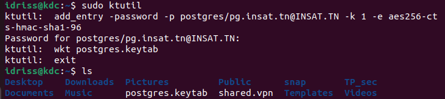

> **Note :** a Kerberos keytab is a file containing the secret keys of Kerberos principals.

We need to send the keytab from the KDC machine to the Service machine.
To do that we need to install openssh server with this command
```
sudo apt-get install openssh-server
```

In Service machine, we create a folder named "pgsql/data" to store the keytab
```
mkdir -p pgsql/data
```

then we go back to the KDC server send the file with this command
```
scp postgres.keytab idriss@pg.insat.tn:/home/idriss/pgsql/data
```

We can verify in the Service machine if the keytab file was successfully sent


We now execute these commands to verify that the service principal was succesfully extracted from the KDC database
```
ktutil
ktutil:  list
ktutil:  read_kt pgsql/data/postgres.keytab
ktutil:  list
```
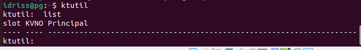

#### Installing and Configuring PostgreSQL

To install we execute :
```
sudo apt-get upgrade
sudo apt-get install postgresql postgresql-contrib

```

> - **postgresql :** core libraby for PostreSQL database management system.
> - **postgresql-contrib :** collection of additional libraries and utilities.

We start by creating role for the client:
```
create user idriss with encryption password 'idriss';
```

We create a new database:
```
create database idriss;
```

The we grant all privileges on the database to the role:
```
grant all privileges on database idriss to idriss;
```
(in the screenshot the role 'idriss' already exists so we created another role just for then demonstration)
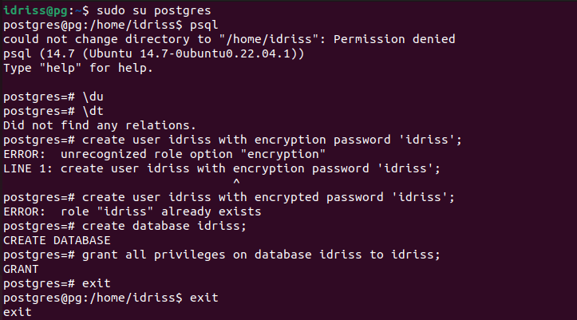


Now we need to configure the "/etc/postgresql/12/main/postgresql.conf" file to change those two line
```
listen_addresses = '*'
krb_server_keyfile = '/home/idriss/pgsql/data/postgres.keytab'
```


> **Note :** "listen_addresses = '*'" means that the PostgreSQL server will listen on all available IP addresses and hostnames for incoming connections.

In the file pg_hba.conf we add the following line
```
# IPv4 local connections:
hostgssenc  idriss   idriss  192.168.56.0/24    gss include_realm=0 krb_realm=INSAT.TN
```
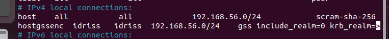

> **Note :** the added line specify that GSSAPI encryption should be used for the communication with the specified host 'idriss' on the specified IP adress range '192.168.56.0/24' using the Kerberos realm 'INSAT.TN' for authentication.

After these chagements we execute this command to restart the service
```
sudo systemctl restart postgresql
```


## 6- Setting The Client Machine

We start by installing those packages (same as the service server)
```
sudo apt-get update
sudo apt-get install krb5-user libpam-krb5 libpam-ccreds
```

the same prompts as in the KDC server will appear and we need to enter the same informations used for the KDC server.
 - Realm : INSAT.TN
 - Kerberos Server : kdc.insat.tn
 - Administrative Server : kdc.insat.tn


## 7- Testing the authentication

We can try by executing this command in the client machine:
```
psql -d idriss -h pg.insat.tn -U idriss
```

> **Note :** the command is instructing to connect to PostreSQL server at 'pg.insat.tn' using the database 'idriss' and the username 'idriss'

The connectiong to PorstreSQL will fail because we don't have a TGT yet
We generate one with this command:
```
klist
kinit idriss
```


Now we try to connect again:

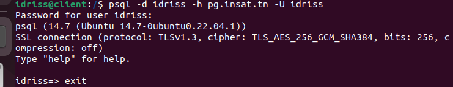

Now we can check the client's tickets so we can verify that we have the ST (service ticket)
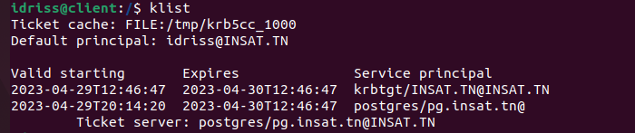

----
## Contributors

[Asma Smida](https://github.com/asmaSmida)
[idriss Khaled](https://github.com/idrisskhaled)
[Salma Yahyaoui]()
[Fares Garrach]()
